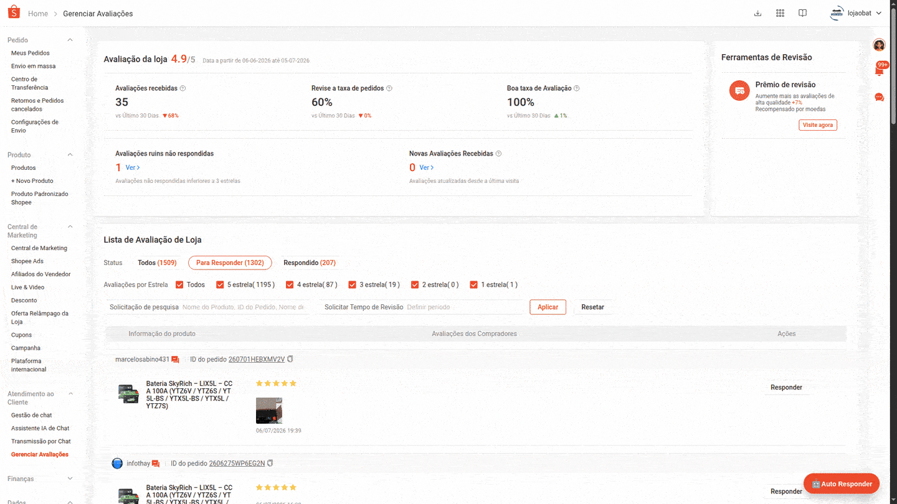

<p align="center">
  
</p>

<h1 align="center">🤖 Auto Responder Shopee</h1>

<p align="center">
  Extensão gratuita e open source para auxiliar vendedores da Shopee a responder avaliações com mais agilidade, controle e padronização.
</p>

<p align="center">
  <a href="https://github.com/ehstbr/auto-responder-shopee-extension"><strong>GitHub</strong></a>
  ·
  <a href="docs/como-usar.md">Como usar</a>
  ·
  <a href="PRIVACY.md">Privacidade</a>
  ·
  <a href="TERMS.md">Termos de Uso</a>
</p>

> ⚠️ **Projeto não oficial.** Esta extensão não é afiliada, endossada, mantida ou patrocinada pela Shopee.

---

## 🎬 Demonstração

<p align="center">
  
</p>

---

## ✨ O que a extensão faz

O **Auto Responder Shopee** ajuda vendedores a responder avaliações da loja diretamente no **Shopee Seller Center**, com respostas pré-configuradas por quantidade de estrelas.

Principais recursos:

- ⭐ **Respostas por nota:** configure mensagens diferentes para avaliações de 1 a 5 estrelas.
- 🎲 **Randomização automática:** cadastre várias respostas por nota para reduzir repetição.
- 🧪 **Modo teste:** preenche a resposta, mas não envia, ideal para validar antes de usar de verdade.
- 📊 **Painel de progresso:** acompanha respostas concluídas, ignoradas, erros e página atual.
- ⏱️ **Estimativa de tempo:** calcula o tempo restante e o término aproximado da execução.
- ⏸️ **Pausar e parar:** permite interromper a automação com mais segurança.
- 🔒 **Privacidade:** não envia dados da conta Shopee para servidores da EduhCommerce.
- 🧩 **Código aberto:** o código pode ser auditado neste repositório.

---

## 🧭 Apresentação do primeiro acesso

No primeiro uso, a extensão apresenta um onboarding com os pontos principais:

1. **Boas-vindas**  
   Uma ferramenta gratuita para ajudar vendedores Shopee a responder avaliações com mais agilidade.

2. **Como usar**  
   Configure respostas por estrela, teste primeiro em modo teste e só depois use o envio real.

3. **Privacidade e código aberto**  
   A extensão roda localmente no navegador e o projeto está disponível no GitHub para transparência.

4. **Termos de uso**  
   O uso depende do aceite dos termos, incluindo isenção de responsabilidade e aviso de ferramenta não oficial.

---

## 🔒 Privacidade, de forma direta

Esta extensão **não foi projetada para coletar**:

- dados de clientes;
- dados de pedidos;
- dados de vendas;
- texto das avaliações;
- texto das respostas cadastradas;
- dados internos da loja Shopee;
- credenciais, senhas ou tokens.

As configurações da extensão são salvas localmente no navegador via `chrome.storage.local`.

A extensão pode consultar endpoints da própria Shopee enquanto você está logado no Seller Center, apenas para obter dados necessários ao funcionamento da interface, como contagens de avaliações a responder. Essas requisições são feitas pelo navegador, dentro da sua própria sessão autenticada na Shopee.

Leia a política completa em: [PRIVACY.md](PRIVACY.md).

---

## ⚠️ Termos e responsabilidade

Esta ferramenta é fornecida **como está**, sem garantia de funcionamento contínuo.

Ao usar a extensão, você entende que:

- o uso é por sua conta e risco;
- a extensão não é oficial da Shopee;
- mudanças no Seller Center podem quebrar a automação;
- você deve revisar suas respostas e configurações;
- você é responsável por cumprir as regras, políticas e boas práticas da Shopee;
- a EduhCommerce e o autor não se responsabilizam por uso indevido, erros, bloqueios, restrições, suspensões, penalidades ou quaisquer consequências relacionadas ao uso da extensão.

Leia os termos completos em: [TERMS.md](TERMS.md).

---

## 🚀 Instalação manual pelo GitHub

Enquanto a extensão não estiver disponível na Chrome Web Store, você pode instalar manualmente:

1. Baixe ou clone este repositório.
2. Abra o Chrome e acesse:

```txt
chrome://extensions/
```

3. Ative o **Modo do desenvolvedor**.
4. Clique em **Carregar sem compactação**.
5. Selecione a pasta:

```txt
extension/
```

6. Acesse o Seller Center da Shopee:

```txt
https://seller.shopee.com.br/
```

7. Abra a página de avaliações e clique em **🤖 Auto Responder**.

---

## 🧪 Uso recomendado

Para evitar erros, use nesta ordem:

1. Abra a página de avaliações da Shopee.
2. Configure as respostas por nota.
3. Deixe o **modo teste** ativado.
4. Execute com um limite baixo, por exemplo 5 ou 10 respostas.
5. Confira se o fluxo está correto.
6. Só depois desative o modo teste para envio real.

> 💡 Para avaliações negativas, use respostas mais empáticas, humanas e orientadas à solução.

---

## 📁 Estrutura do projeto

```txt
auto-responder-shopee-extension/
├── extension/               # Código da extensão carregado no Chrome
│   ├── manifest.json
│   ├── content.js
│   ├── styles.css
│   └── icons/
├── docs/                    # Documentação adicional
│   ├── assets/              # Banner e GIF de demonstração
│   ├── como-usar.md
│   ├── instalacao.md
│   └── publicacao-chrome-web-store.md
├── store-assets/            # Materiais para Chrome Web Store
├── scripts/                 # Scripts auxiliares
├── PRIVACY.md
├── TERMS.md
├── CHANGELOG.md
├── CONTRIBUTING.md
├── SECURITY.md
└── LICENSE
```

---

## 📦 Gerar ZIP para Chrome Web Store

Use o script:

```bash
./scripts/package-extension.sh
```

Ele gera um arquivo `.zip` dentro da pasta `dist/`, contendo apenas os arquivos necessários da pasta `extension/`.

---

## 🧑‍💻 Contribuindo

Sugestões, correções e melhorias são bem-vindas.

Antes de abrir uma issue, verifique se:

- você está usando a versão mais recente;
- recarregou a extensão no `chrome://extensions/`;
- atualizou a página da Shopee com `F5`;
- o problema ainda acontece no modo teste.

Leia: [CONTRIBUTING.md](CONTRIBUTING.md).

---

## 📬 Contato

Projeto EduhCommerce.

- GitHub: [ehstbr/auto-responder-shopee-extension](https://github.com/ehstbr/auto-responder-shopee-extension)
- Instagram: `@eduhcommerce`
- Facebook: `@eduhcommerce`
- Site: `eduhcommerce.com.br` em breve

Para reduzir spam, golpes e tentativas de phishing, o e-mail de contato aparece de forma ofuscada:

```txt
contato [arroba] eduhcommerce.com.br
```

Para suporte público, prefira abrir uma **Issue** no GitHub.

---

## 📄 Licença

Este projeto é distribuído sob a licença MIT. Veja [LICENSE](LICENSE).

